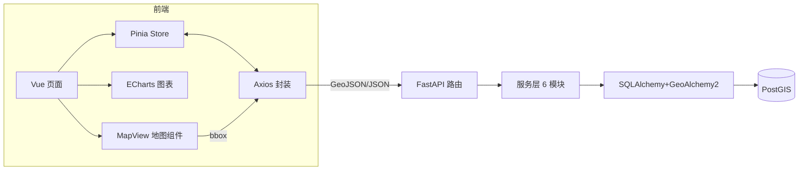

# 02 技术架构

## 1. 六层架构

```
┌────────────────────────────────────────────────────────┐
│ ⑥ 可视化层   MapLibre GL JS（地图） ECharts（图表）     │
│               Element Plus（UI 组件）                   │
├────────────────────────────────────────────────────────┤
│ ⑤ 前端框架层 Vue 3（页面/组件）+ Pinia（状态）          │
│               Vue Router（路由）+ Axios（请求）          │
├────────────────────────────────────────────────────────┤
│ ④ 接口层     FastAPI：10 组路由 /api/*                  │
│               Pydantic 校验 · CORS · 异常处理           │
├────────────────────────────────────────────────────────┤
│ ③ 业务服务层 spatial / regions / shp_import /          │
│               planning_check / analysis / report_gen    │
├────────────────────────────────────────────────────────┤
│ ② 数据访问层 SQLAlchemy 2.0 ORM + GeoAlchemy2          │
│               （空间字段映射 / 会话管理）                │
├────────────────────────────────────────────────────────┤
│ ① 数据存储层 PostgreSQL 16 + PostGIS 3.x               │
│               4 张表 + GiST 空间索引                     │
└────────────────────────────────────────────────────────┘
```

## 2. 一次请求的完整链路

以"服务设施可达性分析（模块三）"为例：

```
浏览器 AccessibilityView 点击"执行可达性分析"
   → Axios POST /api/analysis/accessibility/analyze
       {facility_types, radius_m, scope}
   → FastAPI 路由（Pydantic 参数校验）
   → services/analysis.accessibility_analyze(db, types, 800, scope)
       ├─ DEMO:    shapely 求地块质心 → distance 统计 800m 内 POI
       └─ POSTGIS: 同样用 shapely 实现（与 Demo 结果一致，便于教学对比）
   → 判定：质心到所选设施直线距离 ≤ 服务半径 → 覆盖，否则进盲区清单
   → 返回 JSON（coverage_rate + gaps + parcels_geojson 覆盖专题图）
   → 前端：覆盖率卡片 + 盲区清单表格 + 地图红绿覆盖图层
```

> 模块一（转移矩阵）、模块二（适宜性评价）、模块四（三区三线体检）链路同理：
> 页面 → 路由校验 → services/analysis 或 planning_check 计算 → GeoJSON/统计返回 → 地图 + 图表联动展示。

## 3. 关键设计决策

| 决策 | 方案 | 理由 |
|---|---|---|
| 几何传输格式 | GeoJSON（4326） | 与 MapLibre/PostGIS 原生兼容 |
| 空间运算位置 | 统一 shapely 实现，PostGIS 模式核心叠加用 ST_* | 两种模式结果一致，先懂算法再懂性能 |
| 双模式 | 服务层内部按 runtime_demo_mode 分支 | 一套路由两种数据源 |
| 前端状态 | 单一 Pinia store | 地图/表格/详情跨组件联动 |
| 视野查询 | moveend → bbox → && 粗筛 + ST_Intersects 精判 | 拖动地图动态加载 |
| 跨域 | Vite proxy（开发）+ Nginx 反代（生产） | 浏览器无感 |
| 范围划定 | 分析四模块共用：行政区 / SHP（parse-scope）/ 手动绘制 | 交互一致，减少重复实现 |

## 4. 数据流全景图（Mermaid）



> 下一步：[03-目录结构.md](03-目录结构.md) 逐文件对照代码。
