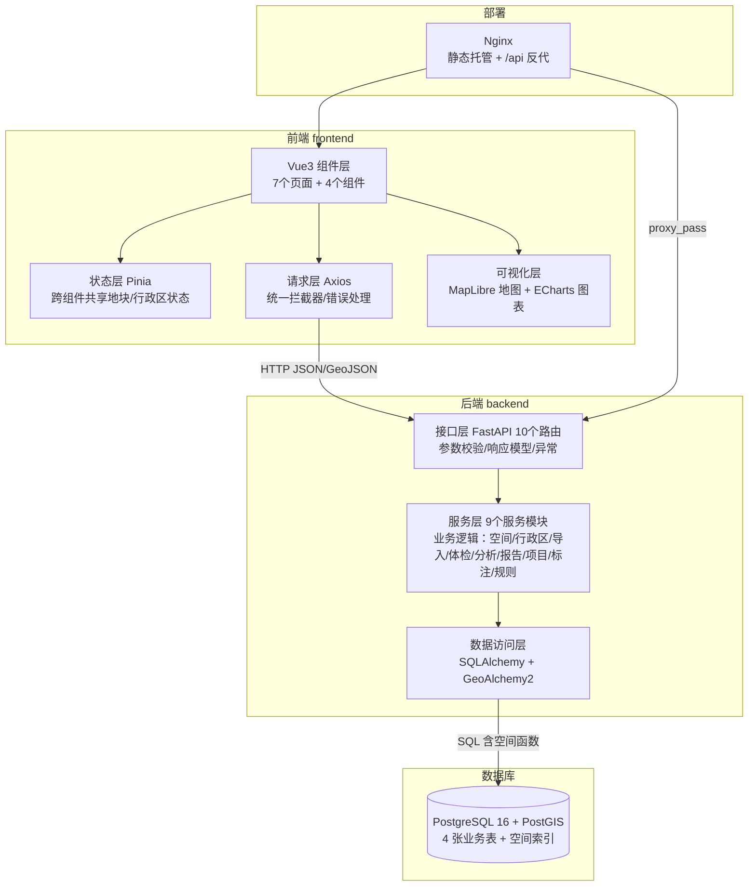
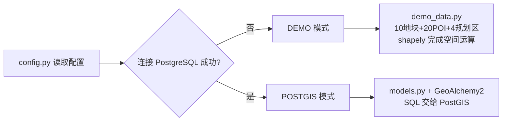
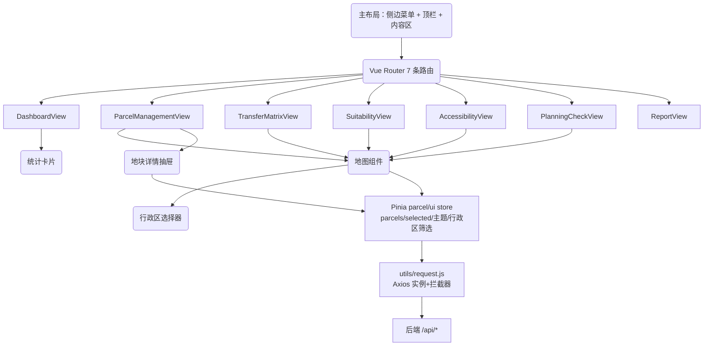

# LandVISION 项目实现框架 —— 实现原理与底层逻辑

> 本文档回答三个问题：
> 1. **这个项目由哪些层组成？每一层做什么？**
> 2. **一次用户操作（如"在地图上点一个地块"）在系统里是如何流动的？**
> 3. **每一层的核心技术原理是什么？为什么这样设计？**
>
> 建议配合代码阅读：先通读本文档，再按 `docs/03-目录结构.md` 逐文件对照。
>
> **v1.1 企业版新增**：统一错误码（errors.py）、中间件体系（请求ID/安全头/限流/审计）、
> 分页规范、健康检查、Alembic 迁移、驾驶舱地图主视觉与图-表联动、企业级地图工具链。
> 升级清单与剩余路线图见 `docs/09-企业级升级说明.md`。

---

## 一、项目定位

LandVISION 是一个 **国土空间数据管理与智能分析可视化平台**，面向规划、自然资源管理场景，提供四大能力：

| 能力 | 说明 | 对应页面 |
|---|---|---|
| 数据管理 | 地块/兴趣点/规划控制要素/行政区划的存储、查询、编辑、SHP 导入 | 地块管理 |
| 智能分析 | 用地转移矩阵、土地适宜性评价、设施可达性分析、三区三线合规性体检 | 分析决策四模块 |
| 可视化 | 交互式地图（全屏主视觉）+ 统计图表 + 报告 | Dashboard / 各页地图与图表 |
| 报告输出 | 一键生成六章节综合分析报告 | 报告 |

它是典型的 **WebGIS 全栈应用**：空间数据存在数据库里，通过 REST API 提供给浏览器，浏览器用 WebGL 地图引擎渲染。

---

## 二、总体架构（六层）



**一句话概括数据流**：`浏览器(图层) ← GeoJSON ← FastAPI(服务层算好) ← PostGIS(SQL 算好) ← 表`。

---

## 三、核心概念：空间数据到底是怎么表示的？

理解本项目，必须先理解空间数据在**四个层面**的表示。这是整个项目的底层逻辑。

| 层面 | 表示形式 | 用途 | 本项目位置 |
|---|---|---|---|
| 数据库层 | **WKT 文本 + PostGIS geometry 类型**（如 `POLYGON((116.4 39.9, ...))`） | 存储、空间索引、空间函数 | `database/01_init_schema.sql` |
| 后端层 | **GeoJSON 字典**（`{"type":"Feature","geometry":{...},"properties":{...}}`） | API 传输、前端可直接消费 | `services/spatial.py` 的 `to_geojson()` |
| Python 内存层 | **Shapely 对象**（Point/Polygon） | 空间运算（相交、缓冲区、距离） | Demo 模式的 `demo_data.py` |
| 前端渲染层 | **MapLibre source+layer** | WebGL 渲染成地图上的图形 | `MapView.vue` |

### 3.1 坐标系（SRID）—— 最容易踩的坑

- **4326（WGS84）**：经纬度坐标系，单位是"度"。全世界通用，**本项目的存储与传输都用它**。
- **3857（Web 墨卡托）**：Web 地图投影，单位是"米"。浏览器底图使用，**只在地图渲染时存在**。
- 关键坑：在 4326 下 `ST_Area` 算出的面积单位是"度²"，**没有意义**。所以项目里所有"面积/距离/缓冲区"运算都要先 `ST_Transform(geom, 3857)` 或用 `::geography` 转换：

```sql
-- 正确：算面积先转投影
SELECT ST_Area(ST_Transform(geom, 3857)) AS area_sqm FROM parcels;

-- 正确：算距离用 geography（球面，单位米）
SELECT ST_Distance(a.geom::geography, b.geom::geography) FROM ...;

-- 错误：4326 下 ST_Area 单位是度²，结果不可用
-- SELECT ST_Area(geom) FROM parcels;
```

### 3.2 GeoJSON —— 前后端的"通用语言"

后端所有地图数据都输出 GeoJSON，结构固定：

```json
{
  "type": "FeatureCollection",
  "features": [
    {
      "type": "Feature",
      "geometry": { "type": "Polygon", "coordinates": [ [ [116.40, 39.90], ... ] ] },
      "properties": { "id": 1, "name": "A-01", "land_use": "居住", "area_sqm": 85000.5 }
    }
  ]
}
```

MapLibre 直接吃这种格式：`map.addSource('parcels', {type:'geojson', data: geojson})`。

---

## 四、数据库层原理（模块一）

### 4.1 四张表的设计逻辑

| 表 | 空间类型 | 核心字段 | 业务角色 |
|---|---|---|---|
| `parcels` 地块 | Polygon | parcel_code/name/land_use(12大类)/district/region_code/area_sqm/period | 平台主角（period 区分基期/末期，转移矩阵用） |
| `pois` 兴趣点 | Point | name/poi_type | 地图展示与检索 |
| `planning_control` 规划控制区 | Polygon | zone_name/zone_type/zone_level | 三区三线体检依据 |
| `regions` 行政区划 | MultiPolygon | code/name/level/parent_code | 省→市→县下钻与定位 |

设计原则：
- **所有几何字段都建 GiST 空间索引** —— 空间查询（相交/范围）本质是"找与某区域重叠的记录"，普通 B-tree 索引无法加速，必须用 R-tree 思想的 GiST。
- **业务主键用自增 id，业务编码用 parcel_code** —— 表内唯一、可读、可追溯。
- **面积冗余存储 area_sqm** —— 虽然可用 PostGIS 现算，但高频展示场景用冗余列换取性能（代价是更新几何时要同步更新，代码中已处理）。

### 4.2 空间查询的底层原理（为什么快）

```
空间查询 = 两阶段过滤
阶段一（粗筛）：Bounding Box 快速过滤，用 && 操作符，走 GiST 索引
阶段二（精判）：对候选记录调用精确空间函数（ST_Intersects 等），代价高但只在少量候选上执行
```

```sql
-- 按视野范围查询地块（项目核心 SQL）
SELECT id, parcel_code, name, ST_AsGeoJSON(geom) AS geometry
FROM parcels
WHERE geom && ST_MakeEnvelope(116.40, 39.89, 116.42, 39.91, 4326)  -- 粗筛：外包矩形
  AND ST_Intersects(geom, ST_MakeEnvelope(...));                   -- 精判（可选）
```

### 4.3 为什么用 PostGIS 而不是 Python 算空间？

- **数据库内计算**：数据不用搬出库，百万级数据也能秒级返回；浏览器拖动地图时高频请求（`moveend` 事件）只有数据库扛得住。
- **SQL 表达空间连接**：`JOIN ... ON ST_Intersects(a.geom, b.geom)` 一次查询完成"每个地块周边有哪些 POI"。
- 本项目 Demo 模式用 shapely 在 Python 里模拟了同样的逻辑（见 4.5），让你**先理解算法，再理解性能**。

---

## 五、后端层原理（模块二）

### 5.1 分层职责与调用链

```
路由层 routers/*.py        → 接收 HTTP 请求、参数校验、返回响应（薄）
服务层 services/*.py       → 业务逻辑：空间运算、分析算法、体检规则（厚）
数据访问层 models/database → ORM 模型 + 会话管理
```

**为什么分层？** 三个理由，也是面试常考：
1. **可测试**：服务层是纯函数，脱离 HTTP 也能单测。
2. **可替换**：本次的"Demo 模式 ↔ PostGIS 模式"只换数据来源，业务逻辑不变。
3. **可维护**：路由只关心"请求长什么样"，不关心"怎么算"。

### 5.2 双模式运行（本项目的重要设计）



- **DEMO 模式**（默认）：`demo_data.py` 内存数据 + `shapely` 做相交/缓冲区/距离。零依赖跑通全链路，**算法与真实模式完全一致**。
- **POSTGIS 模式**：环境变量 `LANDVISION_DB_URL` 指向真实库，服务层改用 SQLAlchemy 查询，SQL 里调用 `ST_*` 空间函数。
- **判定逻辑**：启动时尝试连接数据库（短超时），失败则自动降级 Demo 并打印日志——你永远不会被"数据库没装"卡住。

### 5.3 服务层：六大业务模块的底层逻辑

#### ① `spatial.py` 空间查询
- `list_parcels(...)`：分页 + bbox（`ST_MakeEnvelope` → `&&` 粗筛）+ 用地类型/行政区代码过滤。
- `to_geojson(rows)`：把 ORM 行/字典转成 GeoJSON FeatureCollection（Demo 模式与 PG 模式共用同一输出结构，前端无感）。

#### ② `regions.py` 行政区划服务（v1.2）
- 数据模型：`regions` 表（code/name/level/parent_code/geom），**树形层级** 省(34,内置)→市→县。
- `region_locate(code)`：取几何质心 + 包围盒 → 前端地图飞行定位（**县域查找**的底层实现）。
- 市级/县级经 SHP 导入动态扩展（`shp_import.py`），使"全国范围 → 县域"下钻成为可能。

#### ③ `shp_import.py` SHP 解析与入库（v1.2）
底层流程：

```
zip(.shp/.shx/.dbf/.prj) → pyshp 逐要素读取
  → 坐标系校验（.prj 非 WGS84 → 明确报错并提示 GDAL 转换命令）
  → 字段自动映射（名称/地类/行政区，也可手动指定）
  → 地类容错映射（"住宅"→"住宅用地"…无法识别→"其他土地"）
  → 批量入库（单条失败不影响整批，返回 {imported, skipped}）
```

#### ④ `planning_check.py` 三区三线合规性体检（模块四）
规则（可扩展）：

```
对地块几何与每个规划控制区做 ST_Intersection：
  重叠面积比 = 重叠面积 / 地块面积
  若 zone_type = 生态保护红线 且 重叠>0  → 冲突（严格禁止）
  若 zone_type = 永久基本农田   且 重叠>0  → 冲突
  若 zone_type = 城镇开发边界   且 地块完全在界外 → 警告（未纳入开发边界）
  其余重叠 → 提示（说明管控要求）
```

底层逻辑：**叠加分析（Overlay Analysis）** —— 两张面图层求交，是 GIS 最经典的分析手段。

#### ⑤ `analysis.py` 空间分析三模块（模块一~三）
底层逻辑分别为三种经典 GIS 分析方法：

```
模块一 转移矩阵：两期地块叠加求交（base × current），
        按地类组合统计转换面积，未保留部分=消失、新出现部分=新增；
模块二 适宜性评价：范围内生成 40×40 格网，逐格计算各因子得分（0~100），
        加权叠加后按 ≥80/60~80/40~60/<40 分为四级适宜性；
模块三 可达性分析：地块质心到所选设施（POI）的直线距离 ≤ 服务半径（默认 800m），
        判定覆盖，否则进入盲区清单，汇总为覆盖率。
```

三种模式（DEMO/POSTGIS）共用同一套 shapely 实现，保证结果一致、便于教学对照。

#### ⑥ `report_gen.py` 驾驶舱统筹汇总 + 报告生成
核心函数 `collect_dashboard(db, scope, scope_label)`：**按分析范围**（GeoJSON，可来自行政区任意层级边界或 SHP 范围解析）聚合各模块统计——地块与用地结构 12 大类、行政区分布、转移矩阵、三区三线体检（结论分布+占用台账）、设施可达性（覆盖率+盲区）。`/api/dashboard/summary` 直接返回该结果；`generate_report` 在其上附加报告元信息与"分析范围"说明后渲染 Markdown。**驾驶舱与报告共用同一数据源，保证模块间数据一致**。底层逻辑：**模板 + 数据注入**（先取数，再格式化，与"打印报表"同构）。

### 5.4 路由层的设计约定

- 统一前缀 `/api`，按资源分组（`/parcels`、`/pois`…）。
- 查询用 `GET`、新增 `POST`、修改 `PUT`、删除 `DELETE`（RESTful 约定）。
- 错误统一抛 `HTTPException`，前端拦截器统一弹提示。
- 地图数据接口返回 GeoJSON；表格数据接口返回 JSON 数组。

---

## 六、前端层原理（模块四~六）

### 6.1 页面 → 组件 → 状态 的组织



### 6.2 核心组件的作用与复用

| 组件 | 职责 | 被哪些页面复用 |
|---|---|---|
| `MapView.vue` | 地图初始化、图层管理（含适宜性格网/可达性覆盖叠加层）、要素点击/悬停、弹窗、测量/框选、右侧图标栏（图层/图例/行政区） | 地块管理 / 分析决策四模块 |
| `RegionSelector.vue` | 省→市→县三级联动 + 定位 + 县域过滤（地图右上角） | 内嵌于 MapView |
| `StatsCard.vue` | 数值 + 趋势 + 环比 + 分组的统计卡片 | Dashboard |
| `ParcelInfo.vue` | 地块详情（属性 + 三区三线体检结论） | 地块管理 |

`MapView.vue` 的 props/emits 设计（**组件通信的经典范例**）：

```
props:  geojson(要画的要素), center, zoom, showRegionSelector, enableSelection...
emits:  parcel-click(点击地块→父页面联动表格/图表)
        parcel-detail(弹窗"查看档案"→父页面打开抽屉)
        moveend(bbox)(拖动地图→父页面请求新范围数据→回填 geojson)
        selection(框选统计结果), region-select/locate(行政区选择与定位)
```

### 6.3 MapLibre 渲染原理（模块五）

- **Style（样式）**：定义底图（本项目的 OpenFreeMap 瓦片）与全部图层。
- **Source（数据源）**：`geojson` 类型 source 存放 FeatureCollection。
- **Layer（图层）**：引用 source，用 `paint` 定义视觉样式：
  - `fill`（面）：地块、规划区、变化图斑
  - `line`（边线）：地块边界、缓冲区圆
  - `circle`（点）：POI
- **数据驱动样式**：`fill-color` 用 `match` 表达式按 `land_use` 字段着色 —— 一份数据、多种专题图，这是 WebGIS 的核心魅力。
- **交互**：`click`/`mousemove` 事件 + `queryRenderedFeatures` 命中检测 + `Popup` 弹窗。
- **视野动态加载**：监听 `moveend` → 取 `map.getBounds()` → 请求后端 bbox 接口 → `source.setData(geojson)` 更新。

### 6.4 状态管理（Pinia）与请求封装（Axios）

- **Pinia store**：把"地块列表、当前选中地块、加载状态"提升为全局状态，地图组件与表格组件共享同一份数据，**一处更新、处处联动**。
- **Axios 封装**：统一 `baseURL`（开发走 Vite 代理，生产走 Nginx 反代）、请求/响应拦截器、统一错误提示（Element Plus `ElMessage`）、Token 预留位 —— 后续加登录只需要改一个文件。

### 6.5 图表（ECharts）与 UI（Element Plus）

- ECharts：`init(dom)` → `setOption(option)` → `resize()`。本项目封装了"数据 → option 映射"的简单函数，把后端统计接口的返回值转成柱状/饼状/折线/仪表盘配置。
- Element Plus：表格（`el-table`）、表单（`el-form`）、抽屉（`el-drawer`）、对话框（`el-dialog`）、卡片（`el-card`）覆盖全部管理类交互。

---

## 七、部署层原理（模块七）

```
用户浏览器
   │
   ▼
Nginx (80端口)
   ├── /            → 托管前端 dist/ 静态文件（SPA，history 模式需 try_files 回退）
   └── /api/*       → proxy_pass 转发到 backend:8000
                           │
                           ▼
                    后端容器 (uvicorn)
                           │
                           ▼
                    postgis 容器 (5432)
```

- **Dockerfile 多阶段构建**（前端）：`node 构建阶段` → `nginx 运行阶段`，镜像只留产物，体积小。
- **docker-compose 三服务编排**：`postgis + backend + frontend`，`depends_on` 控制启动顺序，`volumes` 持久化数据库。
- **跨域问题的两种解法**（本项目都覆盖）：
  1. 开发期：Vite `server.proxy` 把 `/api` 代理到后端（浏览器无感，无跨域）。
  2. 生产期：Nginx 反代（同上，无跨域）；后端仍保留 CORS 中间件作为兜底。

---

## 八、一次完整请求的旅程（底层逻辑全景）

以"**通过行政区选择器找到武汉市洪山区，并查看地块详情**"为例：

```
1. 浏览器: 地图右上角行政区选择器 省(湖北省) → 市(武汉市) → 县(洪山区)
2. 前端:   GET /api/regions/420111/locate → {center, bbox}
3. 地图:    jumpTo(center) 飞行定位到洪山区
4. 前端:   GET /api/parcels?region_code=420111 → 10 宗地块
5. 地图:   地块 GeoJSON 渲染（按 12 大类用地国标配色）
6. 点击地块 → Popup 弹窗 → "查看档案"
7. 前端:   GET /api/parcels/{id} + GET /api/planning/check/{id} → 详情抽屉（属性+规划结论）
```

**全链路耗时通常在几十毫秒**——这得益于：空间索引（数据库）、GeoJSON 免转换（后端）、增量更新 setData（前端）。

---

## 九、关键设计决策与取舍（为什么这样做）

| 决策 | 选择 | 理由 |
|---|---|---|
| 空间运算放在哪 | 数据库为主，Demo 用 shapely 模拟 | 学算法先于学性能；数据库可扩展 |
| 用地分类标准 | GB/T 21010-2017 一级类（12 大类） | 国标权威、可扩展至二级类 |
| 行政区数据 | 省级内置 + 市/县 SHP 导入 | 全国覆盖与数据体积的平衡（34 省全几何 0.6MB） |
| SHP 解析 | pyshp（纯 Python） | 避免 geopandas/GDAL 二进制依赖，Python 3.14 兼容 |
| 前端地图引擎 | MapLibre GL JS（开源版 Mapbox GL） | 免费、WebGL、数据驱动样式成熟 |
| 底图 | OpenFreeMap 免费样式，可替换 | 零成本起步，不绑定 key |
| 界面模式 | 地图全屏 + 组件图标化点击展开 | 以地块展示为首要目的（业务要求） |
| 双模式 | 自动降级 Demo | 学习不被环境卡住 |
| 状态管理 | parcel + ui 双 store | 数据与界面状态分离，规模可控 |
| 变化检测 | 先模拟数组，后接真实影像 | 先懂原理（数组差值），再学工程（GDAL） |
| 土地评估模块 | 按业务意见移除 | 区位估价模型无法覆盖全国区域差异 |

---

## 十、学习与实践路径（怎么用这套框架）

1. **第 1 步**：读本框架文档 + `docs/03-目录结构.md`，把每个文件在编辑器里打开扫一遍。
2. **第 2 步**：启动 Demo 后端，打开 `/docs`（Swagger），逐个点接口看返回结构 → 对照 `services/*.py` 看算法。
3. **第 3 步**：启动前端，逐页操作，在浏览器 Network 面板看请求 → 对照 `MapView.vue` 与各 `views/*.vue`。
4. **第 4 步**：装 PostgreSQL+PostGIS，执行 `database/00→01→03→02`，改 `.env` 切 POSTGIS 模式，对比两种模式返回是否一致。
5. **第 5 步**：按《学习指南》模块顺序，逐个模块深入：加三区三线管控规则、导入县域 SHP、调整适宜性因子权重、加登录鉴权、Docker 部署。
6. **实践题**（改代码练手，答案都在框架内）：
   - 在 shp_import.py 给地类映射表增加二级类（如"水田"→"耕地"的细分标注）；
   - 在行政区选择器增加"搜索县域"的远程搜索（getRegions 加 q 参数）；
   - 给地块管理页的 SHP 导入增加导入前预览（解析后先返回 features 列表）；
   - 给适宜性评价增加新因子（如"坡度"，把 flat 模拟值换成真实 DEM 重分类）；
   - 给可达性分析换成真实路网距离（NetworkX + OSMnx 最短路径替换直线距离）；
   - 给三区三线体检增加"城镇开发边界外占比>90% → 警告"的规则并同步台账结论。
